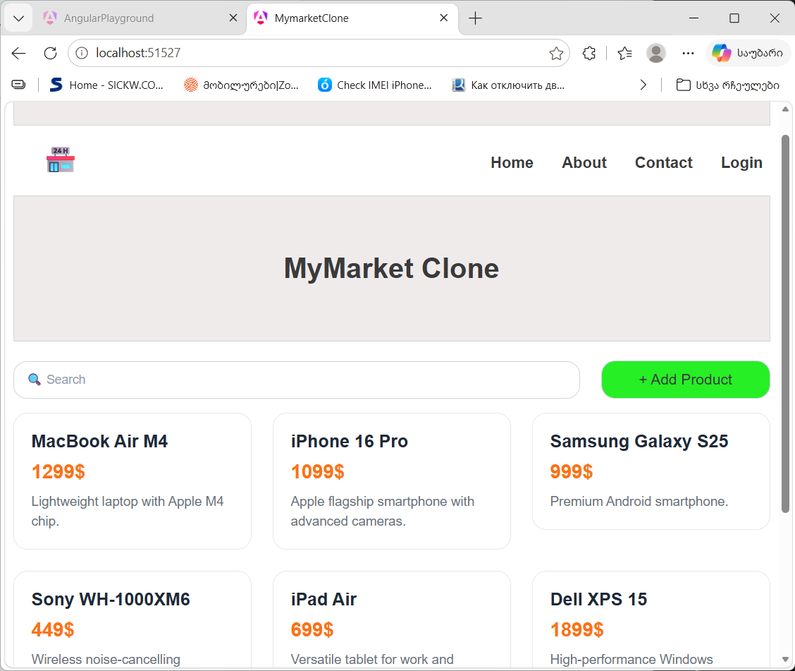
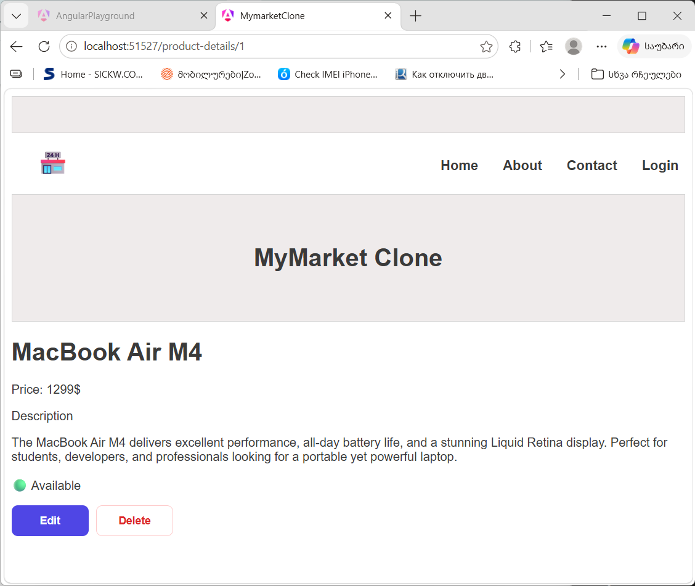
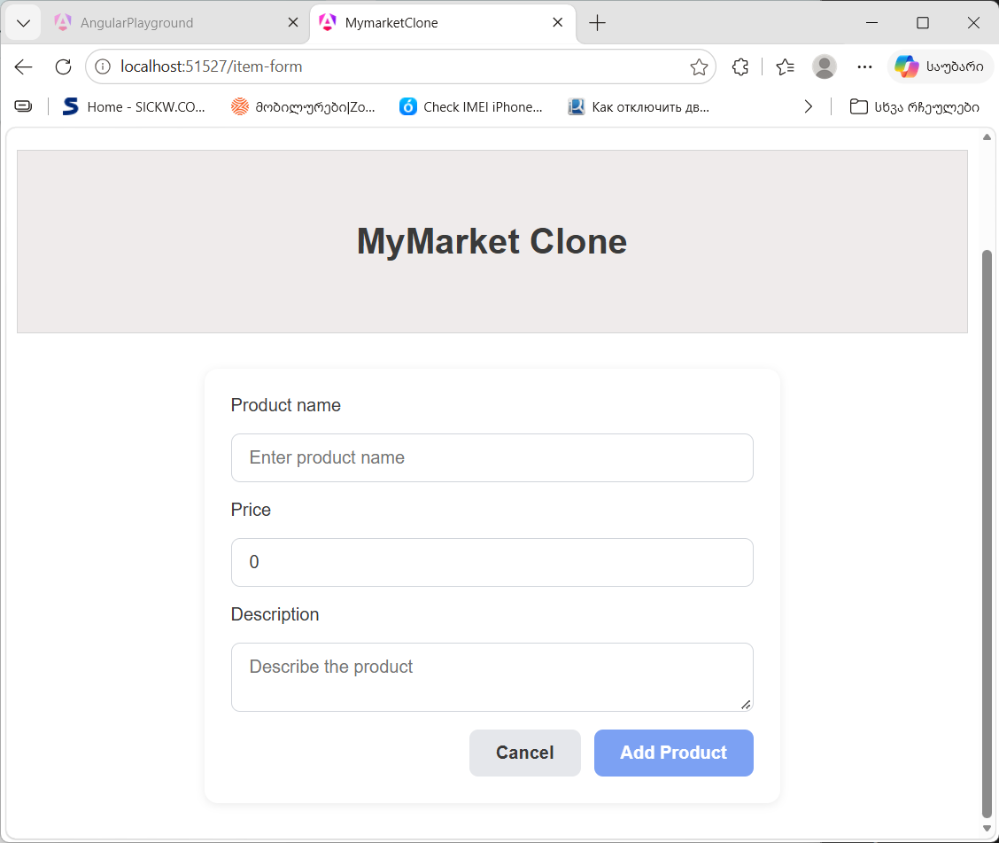
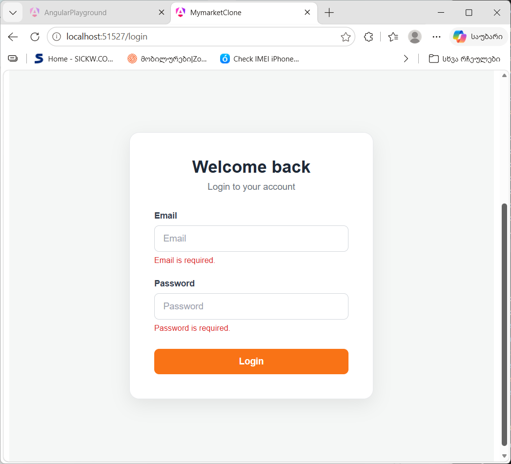

# Mymarket-clone

A marketplace-style CRUD application built with Angular, where users can browse, search, add, edit, and delete product listings.

## Screenshots

### Home



### Product Details



### Add/Edit Product



### Login



## Features

- Browse product listings
- Search products
- View product details
- Add new listings
- Edit existing listings
- Delete listings
- Responsive layout

## Technologies

- Angular
- TypeScript
- Angular Signals
- Reactive Forms
- Angular Router
- HTML5
- CSS3

## Angular Concepts

- Standalone components
- Component communication with @Input() and @Output()
- Angular Signals and computed state
- Reactive Forms and form validation
- Routing and route parameters
- Event binding and property binding
- Dependency injection
- Service-based state management

## Project Structure

src/
└── app/
    ├── about/
    ├── contact/
    ├── dashboard/
    ├── guards/
    |   └── auth-guard.ts
    ├── header/
    ├── home/
    |   └── product-list/
    |       └── product-card/
    ├── item-form/
    ├── login/
    ├── product-details/
    ├── shared/
    |   ├── models/
    |   |   ├── item.interface.ts
    |   └── services
    |       ├── auth-service.ts
    |       └── data.ts
    └── app.routes.ts

## Installation

```bash
git clone https://github.com/teo00000/mymarket-clone
cd mymarket-clone
npm install
ng serve
```

Navigate to: 

```
http://localhost:4200
```

## Author

Developed by **Teona Papiashvili**

GitHub: https://github.com/teo00000